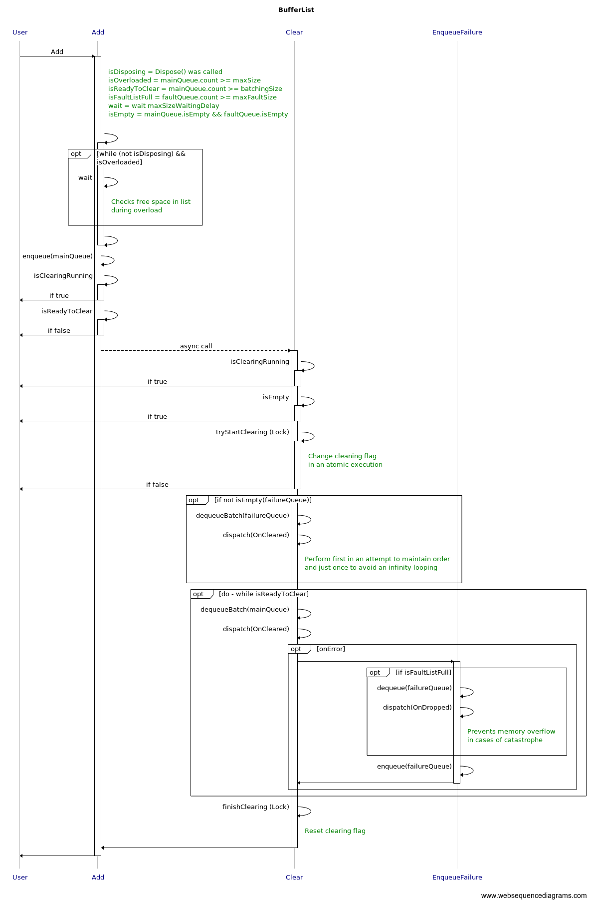

[](https://sonarcloud.io/dashboard?id=tiagor87_tr-bufferlist)
[](https://sonarcloud.io/dashboard?id=tiagor87_tr-bufferlist)
[](http://www.nuget.org/packages/TRBufferList.Core)

# BufferList

BufferList is a component that serves to store components and release them after a period of idle time or when reaching a predefined limit.

## Options

* **int** ClearBatchingSize: Maximum size of the list processed during cleaning
* **int** MaxSize: Maximum size allowed by the list
* **int** MaxFaultSize: Maximum size of the fault list
* **TimeSpan** IdleClearTtl: Expected time to perform cleaning when no items are added
* **TimeSpan** MaxSizeWaitingDelay: Waiting time in each scan iteration for processing when the list is overloaded
* **TimeSpan** DisposeTimeout: Maximum waiting time to perform a complete clean-up during disposal

## Flow



## Events

### Cleared

It is triggered in two scenarios:
* Whenever the batching size is reached;
* Whenever the list is not empty and is idle for the configured amount of time.

### Dropped

It is triggered when:
* The fault list is full and new items need to be added.

### Disposed

It is triggered when:
* The list is processing the disposal and the complete cleaning fails, so some items are still on the fault list.

## Failure recover

When an exception is throw on **Cleared**, the cleared items are added to a failure queue, and on every **Clear** it will try to process the list again respecting the batching size.

## How to use

```c#
var options = new BufferListOptions(
    batchingSize: 100,
    maxSize: 200,
    maxFaultSize: 400,
    clearTtl: TimeSpan.FromSeconds(5),
    maxSizeWaitingDelay: TimeSpan.FromMilliseconds(10),
    disposeTimeout: TimeSpan.FromSeconds(5));
var list = new BufferList<int>(options);
list.Cleared += (items) => {
    // process cleared items
};
list.Dropped += (items) => {
    // process dropped items
};
list.Disposed += (items) => {
    // process faulted items
};

list.Add(1);
```